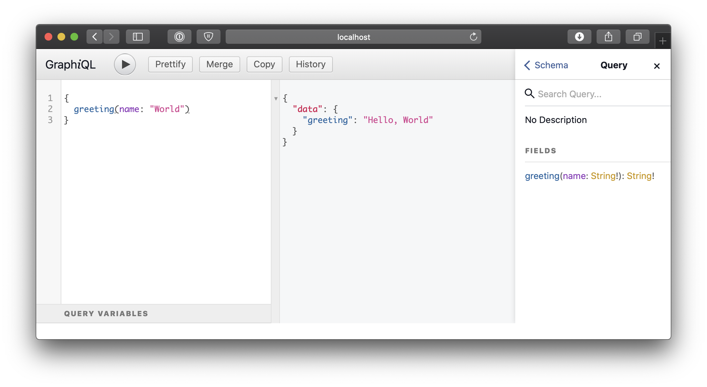
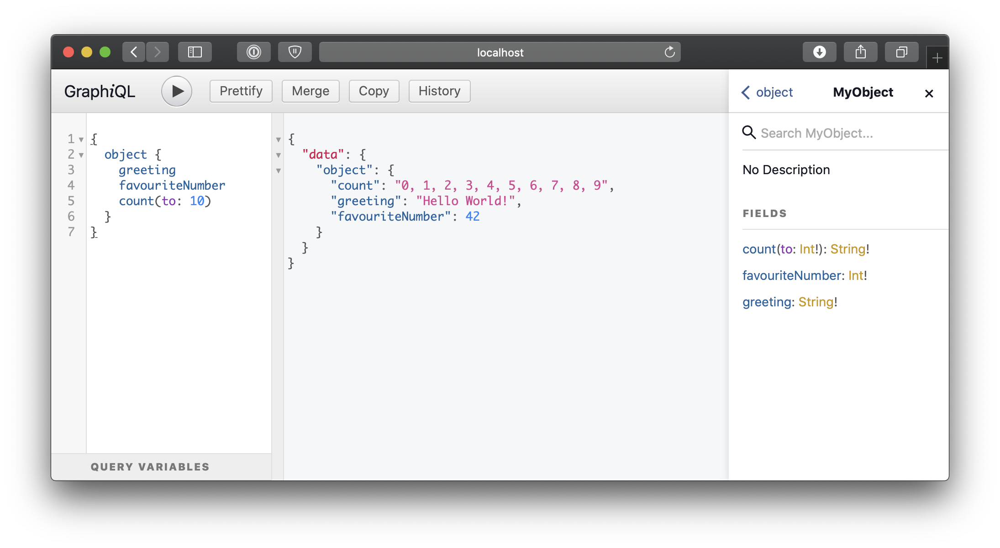
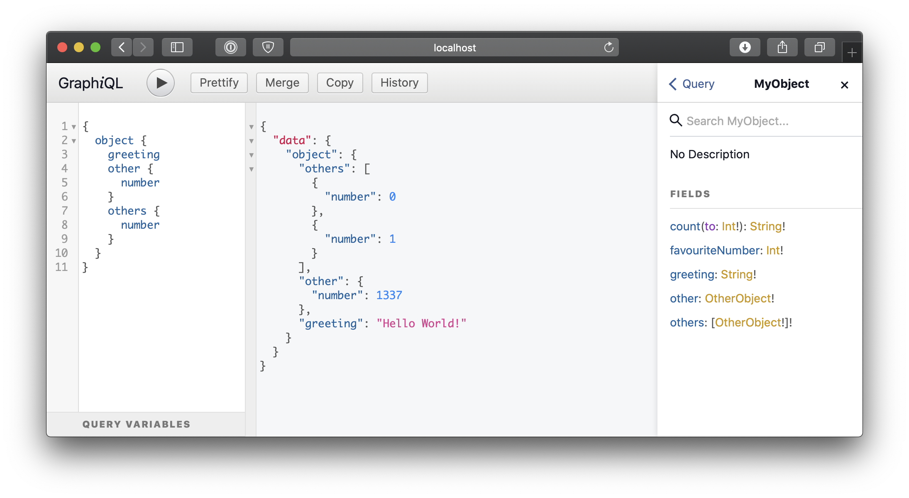
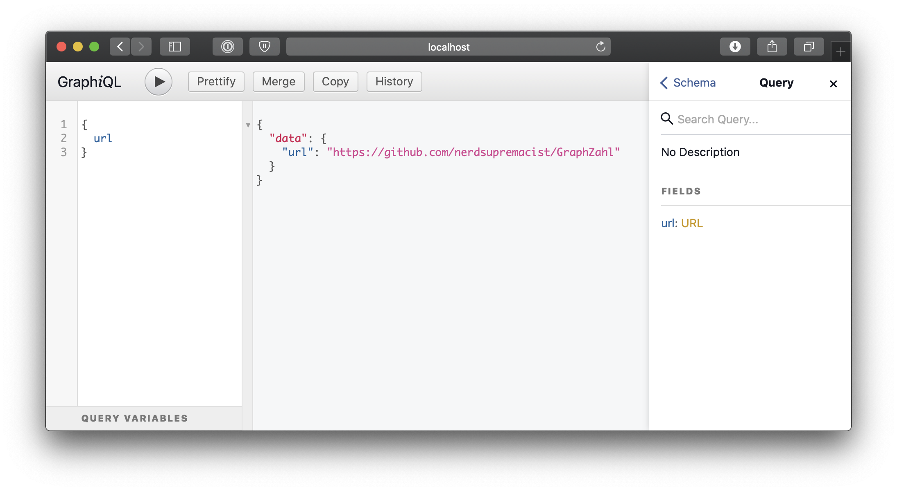

# GraphZahl (Alpha)

Create the best GraphQL APIs ever using Swift. GraphZahl is a Swift Framework that let's you write your Server the simplest way possible! With a magic, Codable-like API.

Here are the main reasons, why you could like it:

- 📝 Declarative
- 📦 Compositable and extendable
- 🔐 Type-Safety
- 🕓 ZERO Boilerplate
- 😍 Familiar and Intuitive Codable-like Feel
- 🤪 Amazing for Quick Prototyping

## TL;DR?

Let's cut the chase and write our Hello World! 

```swift
// Create a GraphQLSchema
enum HelloWorld: GraphQLSchema {
    
    // Describe the Query Type 
    class Query: QueryType {
        func greeting(name: String) -> String {
            return "Hello, \(name)"
        }
    }

    typealias Mutation = None
}

// Run a query using .perform
let result = HelloWorld.perform(request: "...")
```

And you can even connect it to GraphiQL and test it:


*left: a query for data*
*middle: the returned json from our API*
*right: our server API reference*

**Let's break that down!**

Every GraphQL API begins with a root Schema where you define the Query Type and Mutation Type:

- Query Type (Mandatory): Describes all the read operations that can be done
- Mutation Type (Optional): Descripes all the write operations

For now we'll focus on the Query Type. 
GraphZahl will now look at any properties and functions that can be served in GraphQL, and will offer those as fields in your API.

In our example this means that it will find the function `greeting` and see that all the inputs and outputs are availanle as GraphQL Types and register it. Super easy 😍!

## Installation
### Swift Package Manager

You can install GraphZahl via [Swift Package Manager](https://swift.org/package-manager/) by adding the following line to your `Package.swift`:

```swift
import PackageDescription

let package = Package(
    [...]
    dependencies: [
        .Package(url: "https://github.com/nerdsupremacist/GraphZahl.git", majorVersion: XYZ)
    ]
)
```

## Usage

Most users of GraphZahl need to understand the four main provided protocols:

- `GraphQLObject`:  A type that is composed from multiple properties and functions
- `GraphQLSchema`:  The root of any API
- `GraphQLScalar`:  A singular value
- `GraphQLEnum`: An simple enum that is RawRepresentable with String (so no associated values, sadly)

### GraphQLObject

You can provide any class you want by simply making it implement  `GraphQLObject`. 

And voila 😍 !!!! You don't have to implement anything. GraphZahl will do all the magic for you:

- Every property that is either:
    a. a GraphQL Object, 
    a. Scalar 
    a. or Enum

will be available via GraphQL. Zero hassle. Crazy!!!

- Every method where:
    a. every input is a Scalar or Enum
    a. the return type is either:
        a. a GraphQL Object, 
        a. Scalar 
        a. or Enum

is now also available! Just like that. Awesome!!!

**Note:** when it comes to GraphQL Types GraphZahl also supports Optionals, Arrays and Futures out of the box, thanks to Conditional Conformance.

**Let's try it:**

We define our class. With some properties and methods:

```swift
class MyObject: GraphQLObject {
    let greeting = "Hello World!"
    let favouriteNumber = 42

    func count(to number: Int) -> String {
        return (0..<number).map(String.init).joined(separator: ", ")
    }
}
```

And we can see it appear in our API:


*left: a query for the data of MyObject*
*middle: the returned json from our API*
*right: the type definition of MyObject*

Your object can also return nested objects:

```swift
class OtherObject: GraphQLObject {
    let number: Int
    
    init(number: Int) {
        self.number = number
    }
}

class MyObject: GraphQLObject {
    ...
    
    let other = OtherObject(number: 1337)
    let others = [OtherObject(number: 0), OtherObject(number: 1)] // Arrays also work
}
```

And you can see the results immediately:



### GraphQLSchema

A Schema is basically the namespace where you define two objects: A Query and a Mutation Type.
The query and mutation behave like regular `GraphQLObject`s. All the features mentioned above will be included out of the box.

The QueryType is mandatory and always has to be defined! If your API doesn't need Mutations, just set it to `None` like we did before.

**What if you want to make data user dependent?**

That's why Query and Mutation Types come with an extra constraint (for simplicity this was omitted in the snippets before).
They have what we call an associated `ViewerContext` and need an initializer with that ViewerContext. 
*Note: the ViewerContext of the Query and the Mutation have to Match.*

For example a Todo App might look like this:

```
enum TodoApp: GraphQLSchema {
    typealias ViewerContext = LoggedInUser?

    class Query: QueryType {
        let user: LoggedInUser?
        
        func myTodos() -> [Todo]? {
            return user?.todosFromDB()
        }

        required init(viewerContext user: LoggedInUser?) {
            self.user = user
        }
    }

    typealias Mutation = None
}
```

If you don't need a Viewer Context just set it to `Void`:

```
enum HelloWorld: GraphQLSchema {
    typealias ViewerContext = Void

    class Query: QueryType {
        func greeting(name: String) -> String {
            return "Hello, \(name)"
        }

        required init(viewerContext: ViewerContext) { }
    }

    typealias Mutation = None
}
```

### GraphQLScalar

If you have a value that can be represented as a standard Scalar Value, you can return that value as well, with the added Type Safety benefit, of not mixing it with the standard types. 

To implement a `GraphQLScalar` you need to be able to encode and decode it as a `ScalarValue` (String, Number, Bool)   

For example if you want to return URLs you can implement it in an extension:

```swift
extension URL: GraphQLScalar {
    public init(scalar: ScalarValue) throws {
        // attempt to read a string and read a url from it
        guard let url = URL(string: try scalar.string()) else {
            throw ...
        }
        self = url
    }

    public func encodeScalar() throws -> ScalarValue {
        // delegate encoding to absolute string
        return try absoluteString.encodeScalar()
    }
}
```

And presto! Every time a URL comes up in an Object, it will be made available:

```swift
enum HelloWorld: GraphQLSchema {
    class Query: QueryType {
        let url = URL(string: "https://github.com/nerdsupremacist/GraphZahl")
    }

    typealias Mutation = None
}
```



You can do this with virtually all kinds of types: Dates in the format of your choice, Percentages, HTML Text, whatever you want.

## Contributions
Contributions are welcome and encouraged!

## Learn
GraphZahl uses GraphQLSwift, Runtime and Swift NIO under the Hood.
If you are looking for an alternative check out Graphitti, which is more verbose and complex to use, but offers you more control and better performance.

This is currenlty a research project. More details about how it works, will be published later.
This was very difficult to build, so trust me, I really want to talk in detail about it... ;)

## License
GraphZahl is available under the MIT license. See the LICENSE file for more info.

This project is being done under the supervision of the Chair for Applied Software Enginnering at the Technical University of Munich. The chair has everlasting rights to use and maintain this tool.
